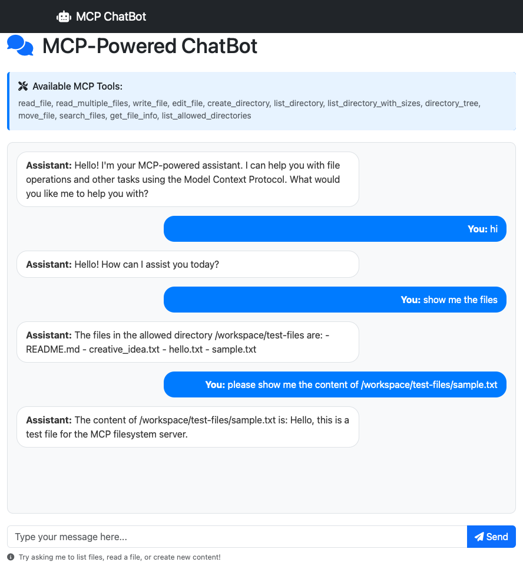

# ASP.NET + npx Docker Image with MCP Client

[](https://codespaces.new/Azure-Samples/app-service-ai-dotnet-chatbot-npx-mcp-client)

This sample demonstrates how to run a Model Context Protocol (MCP) client inside an Azure App Service using a custom container that includes both the .NET runtime and Node.js/npx. The default Linux App Service images for .NET do not include Node.js or npx, which is a popular method to run an MCP server (such as [@modelcontextprotocol/server-filesystem](https://github.com/modelcontextprotocol/servers/tree/main/src/filesystem)). By building a custom Docker image with both runtimes, this sample enables your ASP.NET Core app to invoke MCP tools using npx at runtime.



**How it works:**

- The Dockerfile builds an image with both .NET and Node.js (with npx).
- The app uses the ModelContextProtocol NuGet package to create an MCP client that launches the MCP server using npx (see `Program.cs`).
- The MCP server is started in the `/workspace/test-files` directory, exposing file system tools to the app.
- The ASP.NET Core app registers the MCP client as a tool provider and exposes chat and tool discovery endpoints via SignalR (see `ChatHub.cs`).
- The app is deployed to Azure App Service as a custom container, with managed identity and all required environment variables configured via Bicep and azd.

This approach allows your .NET app to use MCP tools that require Node.js/npx, even in environments (like Azure App Service) where the default images do not support them out of the box.

## Architecture

The included AZD template provisions the following Azure resources:

- **Azure App Service** - Hosts the ASP.NET Core web application with custom container
- **Azure Container Registry** - Stores the container image
- **Azure AI Foundry** - Provides OpenAI GPT models
- **Managed Identity** - For secure authentication between services

## Deploy to Azure

1. Open the repository in a codespace.

2. Login to Azure:

```bash
azd auth login
az login
```

3. Provision the resources:

```bash
azd provision
```

This will:
- Provision all Azure resources
- Build and push the container image to Azure Container Registry
- Deploy the application to Azure App Service
- Configure managed identity and role assignments

## Local development

1. In the terminal, after `azd provision` finishes, get the values of `AZURE_OPENAI_ENDPOINT` and `AZURE_MODEL_DEPLOYMENT`.

    ```bash
    azd env get-values
    ```

2. Open *MCPHostApp/appsettings.Development.json* and add the value of the two variables.

3. In the terminal, run the application.

    ```bash
    cd MCPHostApp
    dotnet run
    ```

4. Select **Open in browser**.

